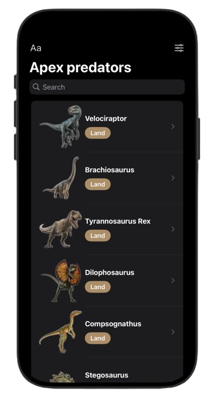
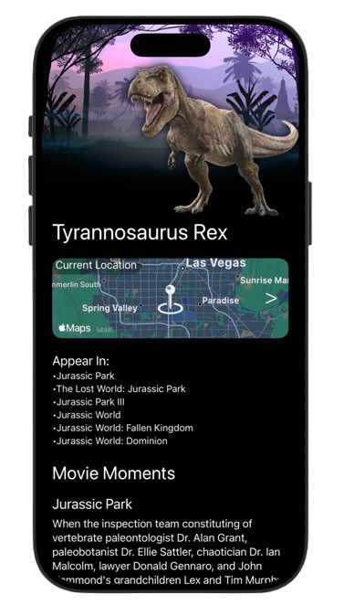
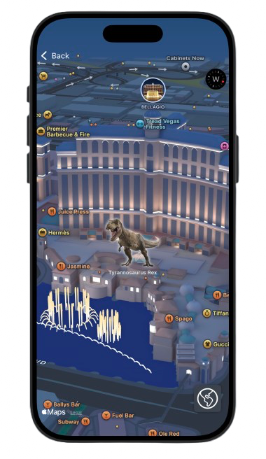

# JPApexPredators: Jurassic Park Dinosaur Information App

Welcome to **JPApexPredators**, the ultimate app for exploring and learning about the fascinating dinosaurs of Jurassic Park! This app provides detailed information about various dinosaur species, their behaviors, habitats, and roles within the Jurassic ecosystem. Whether you’re a paleontology enthusiast, a Jurassic Park fan, or just curious about dinosaurs, this app is your gateway to the prehistoric world.

---
## App Screenshot

<p align="center" style="display: flex;">
  <figure style="margin: 0; text-align: center;">
    
    <figcaption>Home Screen</figcaption>
  </figure>
  <figure style="margin: 0; text-align: center;">
    
    <figcaption>Detail Screen</figcaption>
  </figure>
  <figure style="margin: 0; text-align: center;">
    
    <figcaption>Map Screen</figcaption>
  </figure>
</p>


## Features

### 🦖 **Dinosaur Profiles**
- Comprehensive details about popular Jurassic Park dinosaurs such as Tyrannosaurus Rex, Velociraptors, Brachiosaurus, and more.
- Information includes:
  - Physical characteristics
  - Diet and feeding habits
  - Behavior patterns
  - Historical and fictional context

### 🌳 **Habitat Explorer**
- Visual maps showing the habitats of different dinosaurs within Jurassic Park.
- Interactive overlays to learn about the environment and challenges of each habitat.

### ⚖️ **Predator-Prey Dynamics**
- Discover how dinosaurs interact within the ecosystem.
- Simulate predator-prey scenarios to learn about survival strategies.

### ⭐ **Icon Pack with Dinosaur Graphics**
- Customize your experience with a unique icon pack featuring beautifully designed dinosaur graphics.
- Share your list with friends and fellow enthusiasts.

### ⚛️ **Explore Dinosaurs by U.S. Locations**
- View dinosaurs as they roam through different iconic locations across the United States.
- Explore interactive maps and discover how dinosaurs would have fit into today's world.
  
---

## Technologies Used  
- **SwiftUI** for an intuitive and engaging user interface  
- **MapKit** for interactive map functionality  
- **Core Data** for managing user bookmarks and favorites  
- **Custom Icon Design** to elevate the visual experience  

## Getting Started  

1. **Clone the Repository**:  
   ```bash
   git clone https://github.com/yourusername/JPApexPredators.gitay with **JPApexPredators** and explore the mysteries of prehistoric life!

2. **Open in Xcode**:
Navigate to the project folder and open JPApexPredators.xcodeproj in Xcode.

3. **Run the App**:
Connect a device or use the iOS simulator to build and run the app.

## Contributing

We welcome contributions! Feel free to submit pull requests or open issues for feature suggestions and bug reports.

## License

This project is licensed under the MIT License.

Enjoy exploring the prehistoric world of dinosaurs! 🦖
